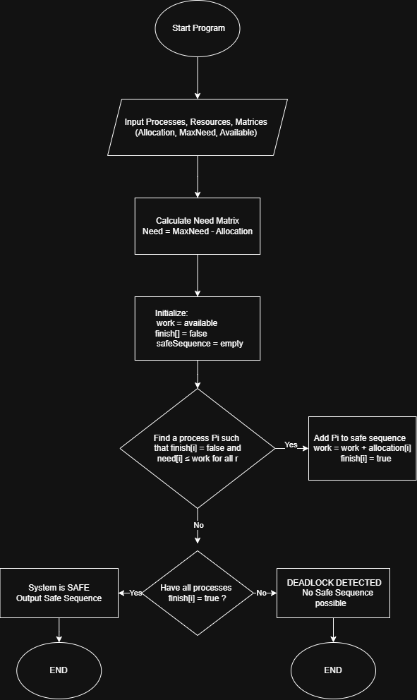
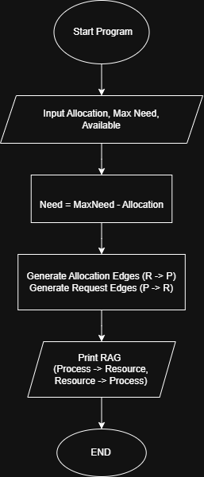
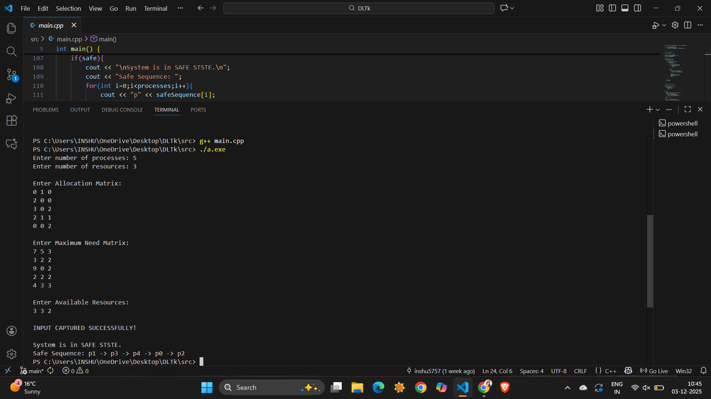
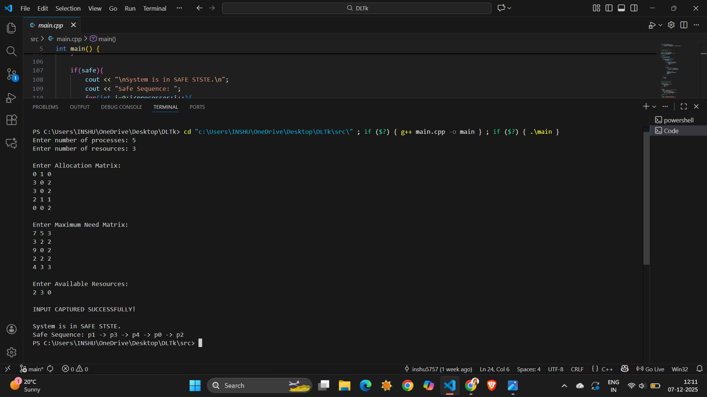
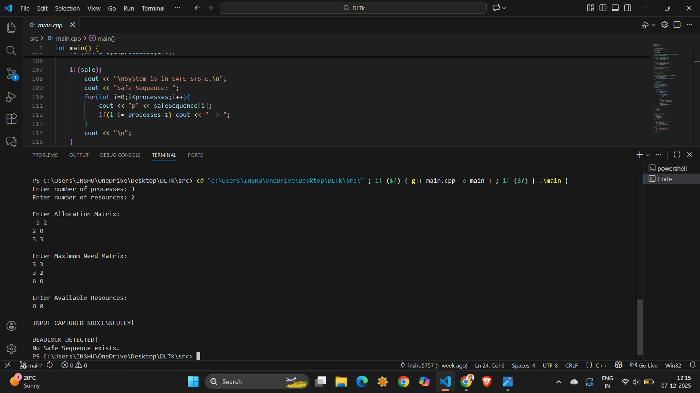
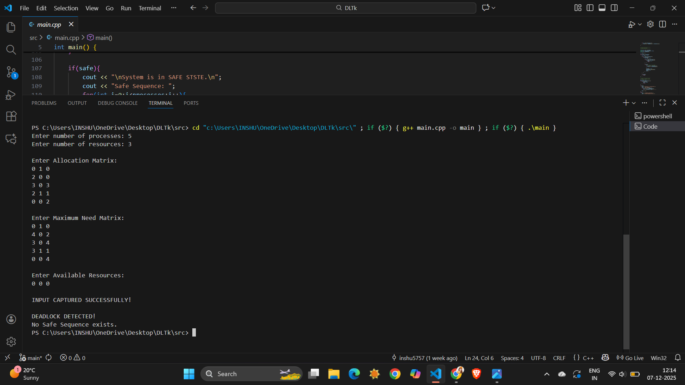
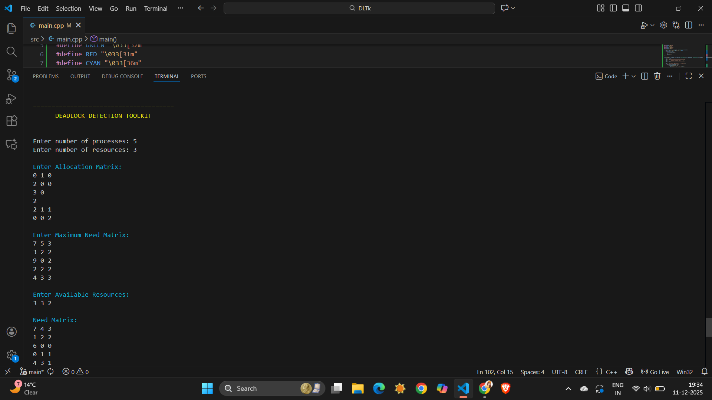
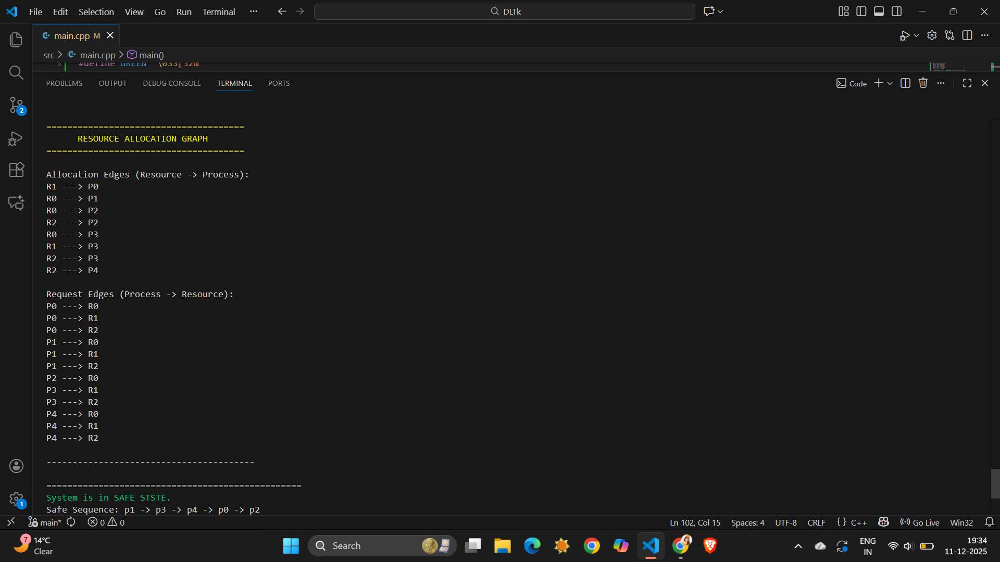

# Deadlock Detection Toolkit
 A C++ implementation of the Banker's Algorithm to detect deadlocks in an operating system.
 This project is part of the CSE316 Operating System Course Assignment(CA2).

 ---

## 📌 Overview

Deadlock occurs in a system when multiple processes are waiting indefinitely for resources held by each other.
This toolkit helps analays system status using the **Banker's Safety Algorithm**, and determines:

- Whether the system is in a **Safe State**
- A valid **Safe Sequence** (if it exists)
- Or if a **Deadlock is Detected**

The program takes:
- Allocation Matrix
- Maximum Need Matrix
- Available Resources

And calculates:
- Need Matrix
- Work Vector
- Safe Sequence

---

## 🧠 Features

✔ Input support for multiple processes and resources
✔ Automatic NEED matrix calculation  
✔ Implementation of Banker's Safety Algorithm
✔ Detection of:
 - Safe State
 - Deadlock State
✔ Clear formatted output
✔ Handles any number of processes and resources
✔ Improved user Interface (colors + borders)
✔ Matrix Printing (Need)
✔ Resource Allocation Graph (RAG) Generation
✔ RAG Flowchart Added
✔ Cleaner project structure

---

## 🛠 Technologies Used

### Programming Language
- **C++**

### Libraries
- `<iostream>`
- `<vector>`
  
### Others 
- **Dynamic Matrix Handling**
- **GitHub** (Version Control)
- **draw.io** (Flow Diagrams)
- **VS Code**

---

## 🖼 Flowc Digram (Banker's Algorithm)

This flowchart represents the overall process of the Banker's Safety Algorithm used in this project.



---

## 🖼 Flow Digram (RAG + Matrix Visualization)
The following flowchart demonstrates the visualization module added in Version 2.0:



---

## 🔍 Resource Allocation Graph (ASCII Output)

This project now prints a **Resource Allocation Graph (RAG)** showing:

- **Allocation Edges (R → P)**  
- **Request Edges (P → R)**
This helps visualize how processes and resources interact.

---
  
## 🖥 Output Screenshots

Below are the results of running the Deadlock Detection Toolkit:

### ✔ Safe State Example


### ✔ Another Safe Example


### 🔴 Deadlock Example


### 🔄 Additional Run


### ⭐ RAG + Matrix Printing 
  


---

## 📥 How to Run

### **1. Clone the repository**

```bash
git clone https://github.com/inshu5757/deadlock-detection-toolkit.git


